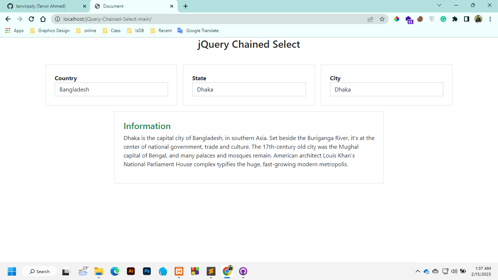

# jQuery-Chained-Select
Chained Select input field using JQuery get method

## Database
1. Create a Database as: **chained_select**
2. import *db.sql* into that database

<!-- all link is here -->

### Contact me:

[E-mail](tanvirpoly@gmail.com)

[Facebook]( https://www.facebook.com/tanvirfbid)

[Linkedin]( https://www.linkedin.com/in/tanvirx/)